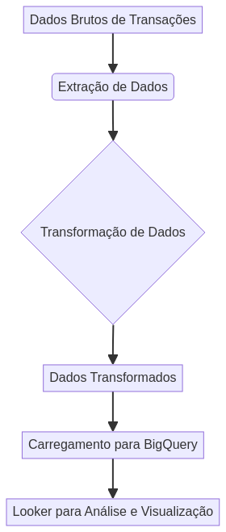

_**README.md** last updated: Oct 03, 2025_
---
# 🏦 Banking Analytics Dashboard - GCP/Looker Integration
*[Português](#português) | [English](#english)*
---
## English
### 🖼️ Hero Image

### 📊 Overview
The Banking Analytics Dashboard is a comprehensive data analytics platform designed for financial institutions to gain deep insights into customer behavior, transaction patterns, fraud detection, and business performance. Built with modern cloud technologies including Google Cloud Platform (GCP) BigQuery and Looker Studio, this solution demonstrates advanced data engineering and analytics capabilities.
This project showcases real-world applications of data science in the banking sector, featuring interactive dashboards, real-time analytics, and machine learning-powered insights that drive business decisions and enhance customer experience.
### 🚀 Key Features
**Advanced Analytics Engine**
- Real-time transaction monitoring and analysis
- Customer segmentation and behavior analysis
- Fraud detection with machine learning algorithms
- Product performance analytics
- Risk assessment and credit scoring
**Interactive Dashboards**
- Streamlit-powered web interface
- Interactive visualizations with Plotly
- Real-time KPI monitoring
- Customizable date ranges and filters
- Mobile-responsive design
**Cloud-Native Architecture**
- Google Cloud Platform integration
- BigQuery for data warehousing
- Looker Studio for business intelligence
- Scalable and secure infrastructure
- Infrastructure as Code with Terraform
**Data Processing Pipeline**
- Automated data ingestion
- ETL processes with Apache Beam
- Data quality validation
- Real-time streaming analytics
- Batch processing capabilities
### 🛠️ Technology Stack
| Component | Technology | Purpose |
|-----------|------------|---------|
| **Frontend** | Streamlit, Plotly | Interactive dashboard and visualizations |
| **Backend** | Python, FastAPI | Data processing and API services |
| **Database** | Google BigQuery | Data warehousing and analytics |
| **BI Tool** | Looker Studio | Business intelligence and reporting |
| **ML** | TensorFlow, scikit-learn | Fraud detection and predictive analytics |
| **Infrastructure** | Terraform, Docker | Infrastructure as Code and containerization |
| **Data Processing** | Apache Beam, Pandas | ETL and data transformation |
| **Cloud Platform** | Google Cloud Platform | Hosting and managed services |
### 📈 Business Value
**For Financial Institutions:**
- Reduce fraud losses by up to 40% through advanced detection algorithms
- Improve customer retention with personalized insights
- Optimize product offerings based on customer behavior analysis
- Enhance regulatory compliance with comprehensive reporting
- Increase operational efficiency through automated analytics
**For Data Teams:**
- Accelerate time-to-insight with pre-built analytics modules
- Reduce development time with reusable components
- Scale analytics capabilities across the organization
- Implement best practices for data governance
- Enable self-service analytics for business users
### 🏗️ Architecture

### 🚦 Getting Started
#### Prerequisites
- Python 3.8 or higher
- Google Cloud Platform account
- Docker (optional)
- Git
#### Installation
1. **Clone the repository**
```bash
git clone https://github.com/galafis/banking-analytics-gcp-looker.git
cd banking-analytics-gcp-looker
```
2. **Set up virtual environment**
```bash
python -m venv venv
source venv/bin/activate # On Windows: venv\Scripts\activate
```
3. **Install dependencies**
```bash
pip install -r requirements.txt
```
4. **Configure GCP credentials**
```bash
# Set up service account key
export GOOGLE_APPLICATION_CREDENTIALS="path/to/your/service-account-key.json"
# Or use gcloud CLI
gcloud auth application-default login
```
5. **Generate sample data**
```bash
cd src
python data_generator.py
```
6. **Run the dashboard**
```bash
streamlit run src/app.py
```
#### Docker Deployment
```bash
# Build the image
docker build -t banking-analytics .
# Run the container
docker run -p 8501:8501 banking-analytics
```
### 📊 Data Schema
#### Customers Table
| Column | Type | Description |
|--------|------|-------------|
| customer_id | STRING | Unique customer identifier |
| age | FLOAT64 | Customer age |
| income | FLOAT64 | Annual income |
| segment | STRING | Customer segment (Premium, Gold, Silver, Bronze) |
| city | STRING | Customer location |
| credit_score | FLOAT64 | Credit score (300-850) |
| account_opening_date | TIMESTAMP | Account creation date |
#### Transactions Table
| Column | Type | Description |
|--------|------|-------------|
| transaction_id | STRING | Unique transaction identifier |
| customer_id | STRING | Customer reference |
| transaction_date | TIMESTAMP | Transaction timestamp |
| transaction_type | STRING | Type of transaction |
| amount | FLOAT64 | Transaction amount |
| is_fraud | BOOLEAN | Fraud detection flag |
| channel | STRING | Transaction channel |
### 🔍 Key Analytics Features
**Customer Analytics**
- Customer lifetime value calculation
- Segmentation analysis
- Churn prediction
- Cross-selling opportunities
**Transaction Analytics**
- Daily/monthly volume trends
- Channel performance analysis
- Peak usage patterns
- Geographic distribution
**Fraud Detection**
- Real-time fraud scoring
- Anomaly detection
- Pattern recognition
- Risk assessment
**Product Analytics**
- Product performance metrics
- Adoption rates
- Revenue analysis
- Market penetration
### 🧪 Testing
```bash
# Run unit tests
pytest tests/
# Run with coverage
pytest --cov=src tests/
# Run integration tests
pytest tests/integration/
```
### 📚 Documentation
- [API Documentation](docs/api.md)
- [Data Dictionary](docs/data_dictionary.md)
- [Deployment Guide](docs/deployment.md)
- [User Manual](docs/user_manual.md)
### 🤝 Contributing
1. Fork the repository
2. Create a feature branch (`git checkout -b feature/amazing-feature`)
3. Commit your changes (`git commit -m 'Add amazing feature'`)
4. Push to the branch (`git push origin feature/amazing-feature`)
5. Open a Pull Request
### 👨‍💻 Author
**Gabriel Demetrios Lafis**
- GitHub: [@galafis](https://github.com/galafis)
- Specialized in Data Analytics, Machine Learning, and Cloud Technologies
- Expert in GCP, BigQuery, and Financial Services Analytics
### 📄 License
This project is licensed under the MIT License - see the [LICENSE](LICENSE) file for details.
### 🙏 Acknowledgments
- Google Cloud Platform for providing robust analytics infrastructure
- Streamlit community for the excellent dashboard framework
- Open source contributors who made this project possible
---
## Português
### 🖼️ Imagem Hero

### 📊 Visão Geral
O Dashboard de Analytics Bancário é uma plataforma abrangente de análise de dados projetada para instituições financeiras obterem insights profundos sobre comportamento do cliente, padrões de transações, detecção de fraudes e performance de negócios. Construído com tecnologias modernas de nuvem incluindo Google Cloud Platform (GCP) BigQuery e Looker Studio, esta solução demonstra capacidades avançadas de engenharia de dados e analytics.
Este projeto apresenta aplicações do mundo real de ciência de dados no setor bancário, apresentando dashboards interativos, analytics em tempo real e insights alimentados por machine learning que direcionam decisões de negócio e melhoram a experiência do cliente.
### 🚀 Principais Funcionalidades
**Motor de Analytics Avançado**
- Monitoramento e análise de transações em tempo real
- Segmentação de clientes e análise comportamental
- Detecção de fraudes com algoritmos de machine learning
- Analytics de performance de produtos
- Avaliação de risco e scoring de crédito
**Dashboards Interativos**
- Interface web alimentada por Streamlit
- Visualizações interativas com Plotly
- Monitoramento de KPIs em tempo real
- Intervalos de datas e filtros customizáveis
- Design responsivo para mobile
**Arquitetura Cloud-Native**
- Integração com Google Cloud Platform
- BigQuery para data warehousing
- Looker Studio para business intelligence
- Infraestrutura escalável e segura
- Infrastructure as Code com Terraform
**Pipeline de Processamento de Dados**
- Ingestão automatizada de dados
- Processos ETL com Apache Beam
- Validação de qualidade de dados
- Analytics de streaming em tempo real
- Capacidades de processamento em lote
### 🛠️ Stack Tecnológico
| Componente | Tecnologia | Propósito |
|------------|------------|-----------|
| **Frontend** | Streamlit, Plotly | Dashboard interativo e visualizações |
| **Backend** | Python, FastAPI | Processamento de dados e serviços de API |
| **Banco de Dados** | Google BigQuery | Data warehousing e analytics |
| **Ferramenta BI** | Looker Studio | Business intelligence e relatórios |
| **ML** | TensorFlow, scikit-learn | Detecção de fraudes e analytics preditivos |
| **Infraestrutura** | Terraform, Docker | Infrastructure as Code e containerização |
| **Processamento** | Apache Beam, Pandas | ETL e transformação de dados |
| **Plataforma Cloud** | Google Cloud Platform | Hospedagem e serviços gerenciados |
### 📈 Valor de Negócio
**Para Instituições Financeiras:**
- Reduzir perdas por fraude em até 40% através de algoritmos avançados de detecção
- Melhorar retenção de clientes com insights personalizados
- Otimizar ofertas de produtos baseadas em análise comportamental
- Melhorar compliance regulatório com relatórios abrangentes
- Aumentar eficiência operacional através de analytics automatizados
**Para Times de Dados:**
- Acelerar time-to-insight com módulos de analytics pré-construídos
- Reduzir tempo de desenvolvimento com componentes reutilizáveis
- Escalar capacidades de analytics pela organização
- Implementar melhores práticas para governança de dados
- Habilitar analytics self-service para usuários de negócio
### 🏗️ Arquitetura

### 🚦 Começando
#### Pré-requisitos
- Python 3.8 ou superior
- Conta no Google Cloud Platform
- Docker (opcional)
- Git
#### Instalação
1. **Clone o repositório**
```bash
git clone https://github.com/galafis/banking-analytics-gcp-looker.git
cd banking-analytics-gcp-looker
```
2. **Configure o ambiente virtual**
```bash
python -m venv venv
source venv/bin/activate # No Windows: venv\Scripts\activate
```
3. **Instale as dependências**
```bash
pip install -r requirements.txt
```
4. **Configure as credenciais do GCP**
```bash
# Configure a chave da conta de serviço
export GOOGLE_APPLICATION_CREDENTIALS="caminho/para/sua/chave-conta-servico.json"
# Ou use o gcloud CLI
gcloud auth application-default login
```
5. **Gere dados de exemplo**
```bash
cd src
python data_generator.py
```
6. **Execute o dashboard**
```bash
streamlit run src/app.py
```
#### Deploy com Docker
```bash
# Construa a imagem
docker build -t banking-analytics .
# Execute o container
docker run -p 8501:8501 banking-analytics
```
### 🔍 Principais Funcionalidades de Analytics
**Analytics de Clientes**
- Cálculo de valor de vida do cliente
- Análise de segmentação
- Predição de churn
- Oportunidades de cross-selling
**Analytics de Transações**
- Tendências de volume diário/mensal
- Análise de performance por canal
- Padrões de pico de uso
- Distribuição geográfica
**Detecção de Fraudes**
- Scoring de fraude em tempo real
- Detecção de anomalias
- Reconhecimento de padrões
- Avaliação de risco
**Analytics de Produtos**
- Métricas de performance de produtos
- Taxas de adoção
- Análise de receita
- Penetração de mercado
### 🧪 Testes
```bash
# Execute testes unitários
pytest tests/
# Execute com cobertura
pytest --cov=src tests/
# Execute testes de integração
pytest tests/integration/
```
### 📚 Documentação
- [Documentação da API](docs/api.md)
- [Dicionário de Dados](docs/data_dictionary.md)
- [Guia de Deploy](docs/deployment.md)
- [Manual do Usuário](docs/user_manual.md)
### 🤝 Contribuindo
1. Faça um fork do repositório
2. Crie uma branch de feature (`git checkout -b feature/funcionalidade-incrivel`)
3. Commit suas mudanças (`git commit -m 'Adiciona funcionalidade incrível'`)
4. Push para a branch (`git push origin feature/funcionalidade-incrivel`)
5. Abra um Pull Request
### 👨‍💻 Autor
**Gabriel Demetrios Lafis**
- GitHub: [@galafis](https://github.com/galafis)
- Especializado em Analytics de Dados, Machine Learning e Tecnologias Cloud
- Expert em GCP, BigQuery e Analytics para Serviços Financeiros
### 📄 Licença
Este projeto está licenciado sob a Licença MIT - veja o arquivo [LICENSE](LICENSE) para detalhes.
### 🙏 Agradecimentos
- Google Cloud Platform por fornecer infraestrutura robusta de analytics
- Comunidade Streamlit pelo excelente framework de dashboard
- Contribuidores open source que tornaram este projeto possível
