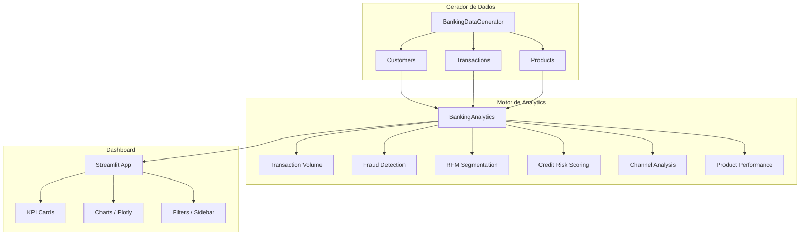
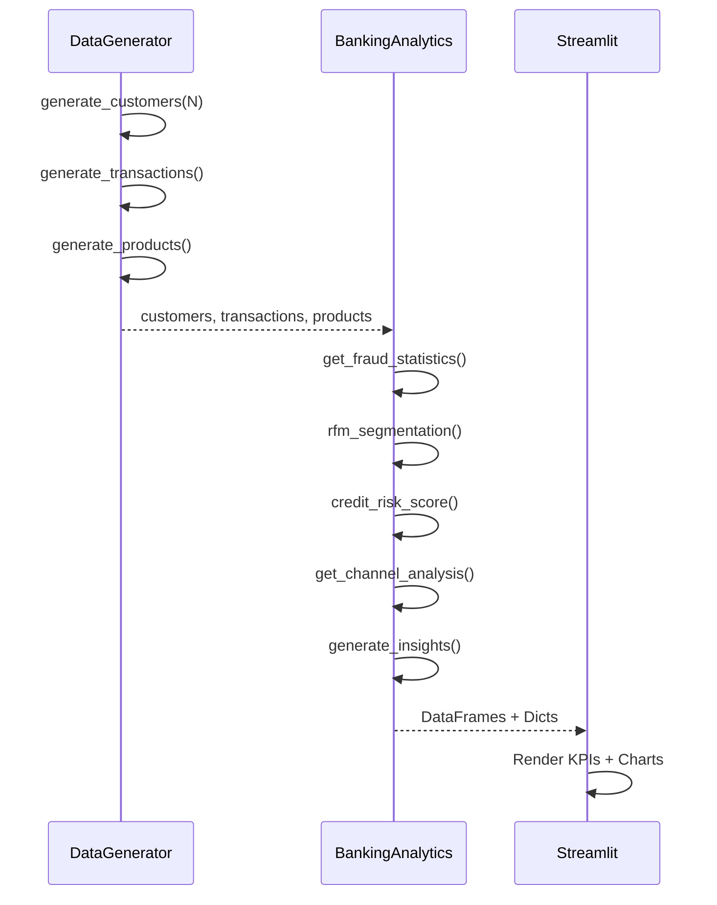

# Banking Analytics Platform (GCP + Looker)


Plataforma de analytics bancario com segmentacao RFM, scoring de risco de credito, deteccao de fraudes, analise de canais e dashboard interativo (Streamlit). Gerador de dados sinteticos para simulacao realista de cenarios bancarios brasileiros.

Banking analytics platform with RFM segmentation, credit risk scoring, fraud detection, channel analysis, and interactive dashboard (Streamlit). Synthetic data generator for realistic simulation of Brazilian banking scenarios.

---

## Arquitetura / Architecture


```mermaid
graph TB
    subgraph Generator["Gerador de Dados"]
        G1[BankingDataGenerator]
        G2[Customers]
        G3[Transactions]
        G4[Products]
    end

    subgraph Engine["Motor de Analytics"]
        E1[BankingAnalytics]
        E2[Transaction Volume]
        E3[Fraud Detection]
        E4[RFM Segmentation]
        E5[Credit Risk Scoring]
        E6[Channel Analysis]
        E7[Product Performance]
    end

    subgraph Dashboard["Dashboard"]
        D1[Streamlit App]
        D2[KPI Cards]
        D3[Charts / Plotly]
        D4[Filters / Sidebar]
    end

    G1 --> G2
    G1 --> G3
    G1 --> G4
    G2 --> E1
    G3 --> E1
    G4 --> E1
    E1 --> E2
    E1 --> E3
    E1 --> E4
    E1 --> E5
    E1 --> E6
    E1 --> E7
    E1 --> D1
    D1 --> D2
    D1 --> D3
    D1 --> D4
```

## Fluxo de Analise / Analysis Flow


```mermaid
sequenceDiagram
    participant Gen as DataGenerator
    participant Eng as BankingAnalytics
    participant Dash as Streamlit

    Gen->>Gen: generate_customers(N)
    Gen->>Gen: generate_transactions()
    Gen->>Gen: generate_products()
    Gen-->>Eng: customers, transactions, products
    Eng->>Eng: get_fraud_statistics()
    Eng->>Eng: rfm_segmentation()
    Eng->>Eng: credit_risk_score()
    Eng->>Eng: get_channel_analysis()
    Eng->>Eng: generate_insights()
    Eng-->>Dash: DataFrames + Dicts
    Dash->>Dash: Render KPIs + Charts
```

## Funcionalidades / Features

| Funcionalidade / Feature | Descricao / Description |
|---|---|
| Data Generator | Gerador de dados sinteticos bancarios / Synthetic banking data generator |
| RFM Segmentation | Recency-Frequency-Monetary com 4 segmentos / RFM with 4 segments |
| Credit Risk Score | Scoring de risco baseado em transacoes e credito / Risk scoring based on transactions and credit |
| Fraud Detection | Estatisticas e tendencias de fraude / Fraud statistics and trends |
| Channel Analysis | Analise por canal (Mobile, ATM, Branch, Internet) / Channel breakdown |
| Product Performance | Desempenho por tipo de produto / Performance by product type |
| Customer Segments | Analise por segmento (Premium, Gold, Silver, Bronze) / Segment analysis |
| Interactive Dashboard | Dashboard Streamlit com filtros e graficos Plotly / Streamlit dashboard with Plotly charts |

## Inicio Rapido / Quick Start

```bash
# Clonar / Clone
git clone https://github.com/galafis/banking-analytics-gcp-looker.git
cd banking-analytics-gcp-looker

# Ambiente virtual / Virtual environment
python -m venv venv
source venv/bin/activate  # Windows: venv\Scripts\activate

# Dependencias / Dependencies
pip install -r requirements.txt

# Executar dashboard / Run dashboard
streamlit run frontend/app.py
```

## Testes / Tests

```bash
pytest tests/ -v
```

## Estrutura / Structure

```
banking-analytics-gcp-looker/
├── backend/
│   └── services/
│       ├── analytics_engine.py    # Motor de analytics / Analytics engine
│       └── data_generator.py      # Gerador de dados / Data generator
├── frontend/
│   └── app.py                     # Dashboard Streamlit
├── tests/
│   └── unit/
│       └── test_analytics.py      # Testes unitarios / Unit tests
├── config/
├── data/
├── requirements.txt
└── README.md
```

## Tecnologias / Technologies

- Python 3.12+
- pandas, numpy
- Streamlit, Plotly
- pytest

## Licenca / License

MIT License - veja [LICENSE](LICENSE) / see [LICENSE](LICENSE).

## Autor / Author

**Gabriel Demetrios Lafis**
- GitHub: [@galafis](https://github.com/galafis)
